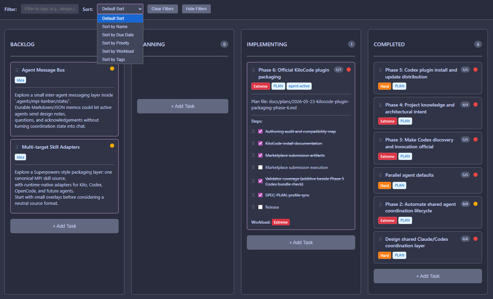

# Mpi-Kanban

An Agent Skills pack that lets multiple AI agents work side by side on the
same project - even on the same files - without overwriting each other.
Agents share a live coordination state so one can implement while another
reviews, verifies, or integrates, and a visible JSON task board keeps you in
the loop on what every agent is doing. Bundles the full MPI workflow (brainstorm,
plan, continue, parallel execution, handoff, end session, cleanup) so a single
session or a whole team of agents can pick up work, coordinate file ownership,
and ship together.

Skills: `mpi-init`, `mpi-project-refresh`, `mpi-brainstorm`,
`mpi-create-plan`, `mpi-create-large-plan`, `mpi-continue`,
`mpi-execute-parallel`, `mpi-nimbalyst-sync`, `mpi-handoff`,
`mpi-end-session`, `mpi-cleanup`, `mpi-archive`, `mpi-brief-rule`, and the
support skill `mpi-lib`.

## Install

Install the complete pack with skills.sh / `npx skills`:

```text
npx skills add MadPonyInteractive/mpi-kanban --all -y -g
```

The `--all` flag is required. The workflow skills locate shared reference
docs through the sibling `mpi-lib` support skill; partial installs are
unsupported.

More detail: [docs/install.md](docs/install.md).

## Update

Update the installed pack with the same command:

```text
npx skills add MadPonyInteractive/mpi-kanban --all -y -g
```

Restart your agent sessions after updating so they reload the installed skills.

## Use

Natural language is the intended interface:

```text
brainstorm with me
initialize MPI
create a plan
create a large plan
continue this MPI plan
refresh MPI
create an MPI handoff
MPI end session
run MPI cleanup
```

Direct invocation depends on the agent. Use the Agent Skills invocation surface
your tool provides, such as `mpi-continue`, `/mpi-continue`, or an equivalent
skill command.

## Task Board

The primary board is a small JSON index:

```text
.agents/mpi-kanban/board.json
```

It has three fixed human columns: `To do`, `Doing`, and `Done`. Each card has a
system-assigned visible ID such as `MPI-42`, and its detailed workspace lives
under:

```text
.agents/mpi-kanban/tasks/MPI-42/
```

Task folders keep the card compact: `task.json` stores the visible metadata,
while `brief.md`, `plan.md`, `checklist.md`, `validation.md`, `files.json`,
`events.jsonl`, `handoffs/`, and `research/` hold the work detail.

The companion **Mpi-Kanban** VS Code extension renders the board as an
interactive task surface:

- Marketplace ID: `MadPonyInteractive.mpi-kanban`
- Repository: <https://github.com/MadPonyInteractive/mpi-kanban-vscode>
- Extension page: <https://marketplace.visualstudio.com/items?itemName=MadPonyInteractive.mpi-kanban>



To open the board, press `Ctrl+Shift+P` (`Cmd+Shift+P` on macOS) and run
**Mpi-Kanban: Open Mpi-Kanban Board**.

Legacy projects may still contain `.agents/mpi-kanban/kanban.md`. That file is
kept for migration or snapshots; once `board.json` exists, workflows should not
maintain both files as live sources of truth.

## Workflow

The normal loop is:

```text
brainstorm -> create-plan/create-large-plan -> continue -> handoff/continue -> end-session -> cleanup
```

- `mpi-brainstorm` explores an idea and can capture it as a `todo` task.
- `mpi-create-plan` creates compact plans for normal work.
- `mpi-create-large-plan` creates phased/adaptive plans and explicit parallel
  batches when work can be split safely.
- `mpi-continue` resumes from the current task ID, plan, handoff, board state,
  and repo state; it claims files before editing.
- `mpi-execute-parallel` executes explicit safe parallel batches.
- `mpi-nimbalyst-sync` coordinates source-of-truth mode, detection, dry-run
  import/export boundaries, and tracker mappings for Nimbalyst interop.
- `mpi-handoff` writes canonical handoff JSON under
  `.agents/mpi-kanban/state/handoffs/`.
- `mpi-end-session` preserves knowledge, commits when appropriate, and moves
  implemented work into validation or closes explicitly validated work.
- `mpi-cleanup` proposes conservative cleanup for old workflow artifacts.

Board lifecycle is `To do -> Doing -> Done`. Planning, checklists, validation,
attention, and handoffs live in the task workspace instead of being embedded in
card bodies.

## Project Knowledge

Mpi-Kanban can maintain durable project knowledge:

- `.agents/mpi-kanban/project-profile.md`
- `.agents/mpi-kanban/project-knowledge-index.md`

Run `mpi-init` once per project. It creates or migrates the JSON board,
establishes project knowledge, and records the project mode. Later, use
`mpi-project-refresh` to audit drift, update project knowledge, or change the
project mode.

## Coordination

Agents coordinate through `.agents/mpi-kanban/state/`:

- `index.json` is the first file agents read.
- Sessions record role and heartbeat.
- Coordination tasks connect agent sessions to a plan and task-board item.
- File claims are active write locks.
- Handoffs preserve state for a fresh session.

Task-card badges and attention state are display summaries only. The
coordination state is the source of truth for agent ownership and handoffs.

For Nimbalyst interop, source-of-truth mode lives in
`.agents/mpi-kanban/state/interop.json`. Default `file` mode keeps normal MPI
JSON board updates. In `nimbalyst` mode, Nimbalyst trackers/sessions are
canonical and MPI board snapshots happen only at explicit sync boundaries.

Expected behavior by environment:

- VS Code and generic agents: stay in `file` mode; MPI updates
  `.agents/mpi-kanban/board.json`, task folders, and event logs, and the
  extension renders them.
- Nimbalyst: switch to `nimbalyst` mode only after explicit approval; update
  Nimbalyst trackers/sessions during normal work, and use `mpi-nimbalyst-sync`
  for import/export snapshots.

## Per-Project Config

For rule briefings and worker bundles, create `.agents/mpi-kanban.local.md`
using the template at
`skills/mpi-brief-rule/templates/mpi-kanban.local.md`.

## Migration

Older releases used Claude Code and Codex plugin manifests. Those install
surfaces are removed. Reinstall through skills.sh:

```text
npx skills add MadPonyInteractive/mpi-kanban --all -y -g
```

For existing projects that used older MPI locations or Markdown boards, run
`mpi-init` after updating. It detects legacy `.claude/mpi-kanban/` and
`.agents/mpi-kanban/kanban.md` board files and proposes JSON-board migration
without silently overwriting current files or deleting legacy directories.

If a workflow skill cannot find `mpi-lib`, reinstall with the full command
above.

## Development

- [SPEC.md](SPEC.md) is the design source of truth.
- [PLAN.md](PLAN.md) tracks implementation phases.
- Run `python scripts/validate_plugin.py` before release.
- Update your local installed copy from this checkout with:
  `npx skills add . --all -y -g`.
- Release by tagging and pushing; `.github/workflows/release.yml` builds the
  GitHub Release from `CHANGELOG.md`.

## License

MIT - see [LICENSE](LICENSE).
